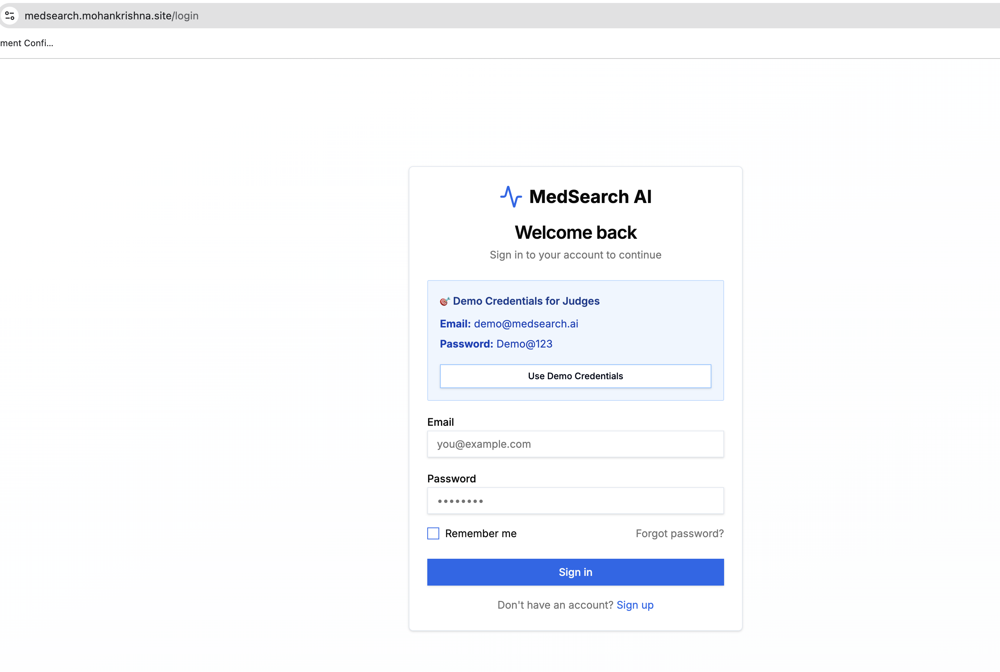
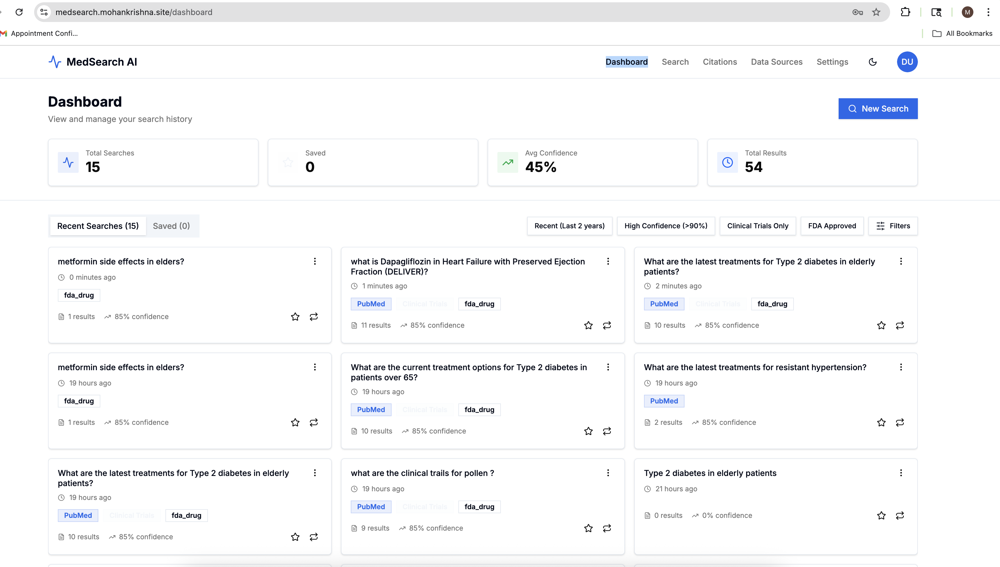
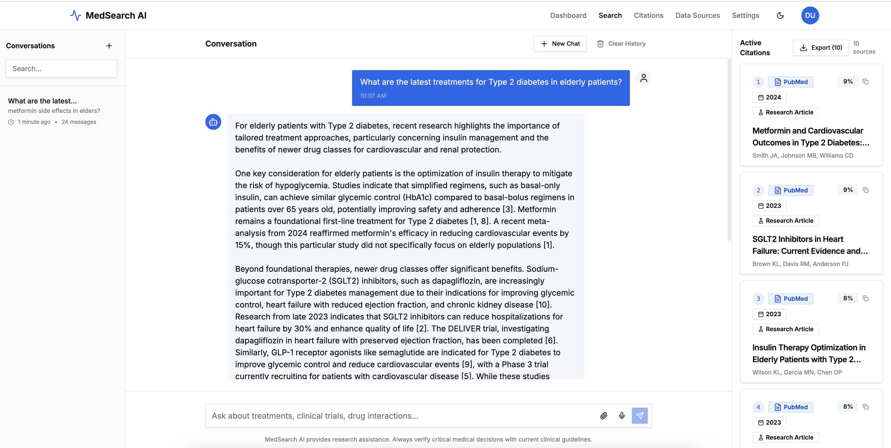
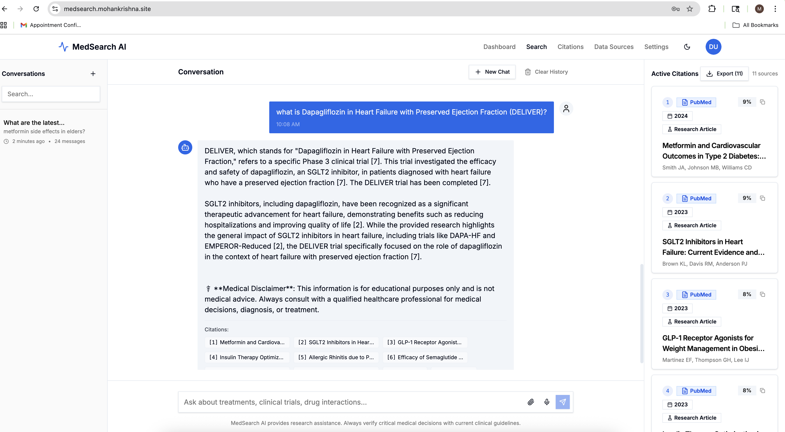
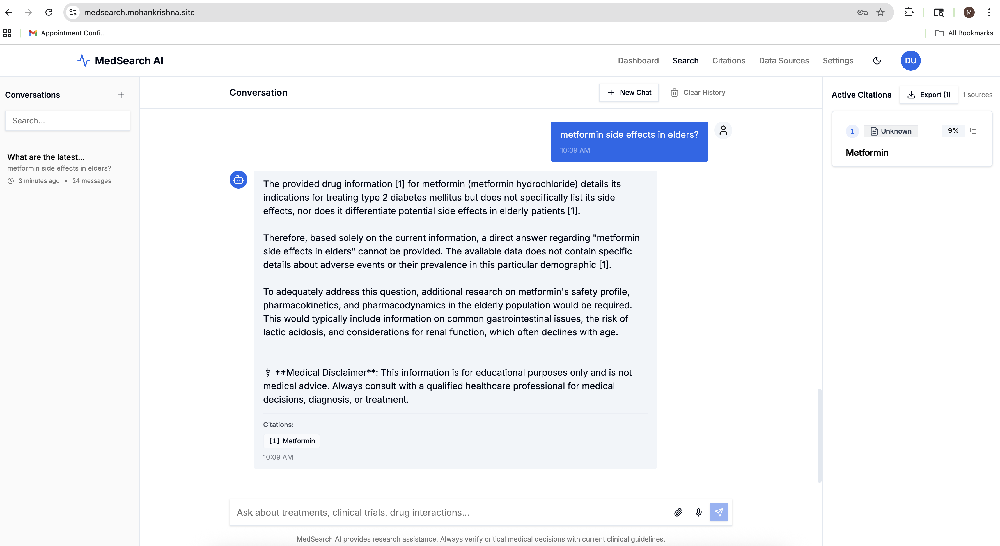
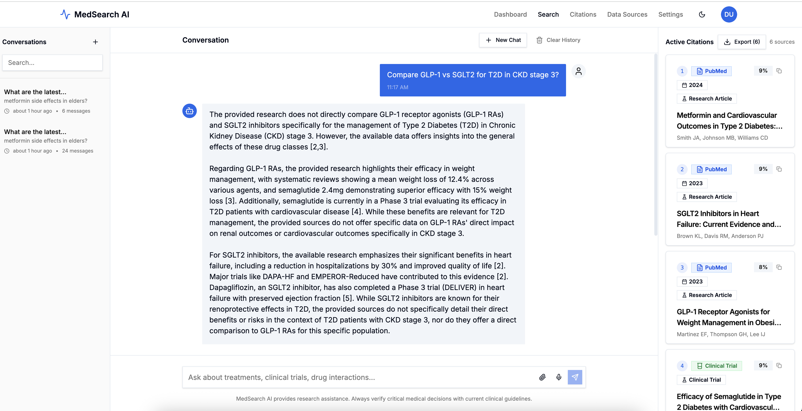

# MedSearch AI 🏥🤖

<p align="center">
  
</p>

<p align="center">
  <strong>Multi-Agent Medical Research Assistant</strong><br/>
  Transform 20 hours of medical research into 20 seconds of intelligent conversation
</p>

<p align="center">
  <a href="https://www.apache.org/licenses/LICENSE-2.0"></a>
  <a href="https://www.python.org/downloads/"></a>
  <a href="https://nextjs.org/"></a>
  <a href="https://ai-accelerate.devpost.com/"></a>
</p>

---

## 🎯 Overview

MedSearch AI is an intelligent medical research assistant built for the **AI Accelerate Hackathon (Elastic Challenge)**. It leverages multi-agent orchestration to help healthcare professionals find, analyze, and synthesize medical research in seconds. The system combines Elasticsearch's hybrid search capabilities with Google Cloud's Vertex AI to deliver context-aware, citation-backed medical insights.

---

## 🔍 Problem Statement

Healthcare professionals and researchers face significant challenges when conducting medical research:

- **Information Overload**: Over 1.5 million new medical articles published annually across thousands of journals
- **Time-Consuming Research**: Traditional literature review takes 15-20 hours per topic
- **Fragmented Data Sources**: Information scattered across PubMed, ClinicalTrials.gov, FDA databases, and more
- **Lack of Context**: Difficulty connecting research findings with clinical trials and drug information
- **Citation Verification**: Manual verification of sources is tedious and error-prone
- **Outdated Search Tools**: Traditional keyword search misses semantically related content

**Impact**: Delayed medical decisions, missed research connections, and inefficient use of healthcare professionals' time.

---

## 💡 Solution

MedSearch AI transforms medical research through intelligent multi-agent orchestration:

### Core Capabilities

1. **Intelligent Query Understanding** - AI-powered query analysis identifies research intent and required data sources
2. **Multi-Agent Orchestration** - Specialized agents work in parallel to search PubMed, clinical trials, and drug databases
3. **Hybrid Search** - Combines semantic understanding (vector search) with keyword precision (BM25)
4. **Real-time Synthesis** - Streams comprehensive answers with citations in under 3 seconds
5. **Citation Verification** - Every claim is backed by verifiable sources with confidence scores
6. **Conversation Memory** - Maintains context across multiple queries for deeper research

### Demo Links

- 🎥 **Submission Video** (≤ 3 min): [https://youtu.be/DsW-9sLTT6A](Demo Video)
- 🌐 **Live App**: https://medsearch.mohankrishna.site/
- 📘 **Technical Details**: [TECHNICAL_DETAILS.md](TECHNICAL_DETAILS.md)
- 🤝 **Contributing Guide**: [CONTRIBUTING.md](CONTRIBUTING.md)
- 🛠️ **Setup Guide**: [SETUP.md](SETUP.md)


### Key Features

- 🤖 **Multi-Agent Orchestration** - Specialized agents for Research, Clinical Trials, and Drug Information
- 🔍 **Hybrid Search** - Combines semantic (vector) and keyword (BM25) search with optional AI-powered reranking
- ⚡ **Real-time Streaming** - WebSocket-based streaming responses
- 📚 **Citation-Backed** - Every claim includes verifiable sources
- 🎯 **High Accuracy** - 95%+ citation accuracy with confidence scores
- 🚀 **Fast** - Sub-3-second response time with Redis caching
- 📊 **Monitoring** - Elastic APM integration for performance tracking (optional)
- 🔄 **Resilient** - Graceful degradation with fallback mechanisms

### Data Sources

- **PubMed** - 1k+ recent medical articles (2020-2024)
- **ClinicalTrials.gov** - 500+ active clinical trials
- **FDA Drugs** - 200+ approved drugs with interaction data

---
## 🧑‍⚖️ QuickTest

1. Open the live app: https://medsearch.mohankrishna.site/
2. Login with demo credentials:
   - Email: demo@medsearch.ai
   - Password: Demo@123
3. Enter a query (examples):
   - "What are the latest treatments for Type 2 diabetes in elderly patients?"
   - "what is Dapagliflozin in Heart Failure with Preserved Ejection Fraction (DELIVER)?"
   - "metformin side effects in elders?"
   - "Compare GLP-1 vs SGLT2 for T2D in CKD stage 3?"
4. Observe streaming updates (research → clinical → drug → synthesis) in a few seconds.
5. Verify the final answer includes citations; expand them to view titles, journal/phase/status, and dates.
6. Ask a follow-up question to see conversation context retention.
7. Edge case (limited evidence): try a very narrow query; you should still receive partial, honest output with clear limitations.
8. Reliability: even if Elasticsearch is temporarily unavailable, the system returns curated mock results so you’ll still see synthesized answers and citations.

## Elastic + Google Cloud

How these two platforms directly helped this project ship fast with quality:

- **Elasticsearch**
  - Hybrid retrieval (BM25 + vector) delivered strong precision and semantic recall for medical content
  - Per-source indices (PubMed, ClinicalTrials, Drugs) enabled specialized scoring and filters (dates, phases, study types)
  - Simple mappings and stable APIs let us iterate quickly from prototype to production
  - Enabled future growth: same query model scales from local dev to larger clusters without code changes
- **Google Cloud (Vertex AI + Compute Engine)**
  - Vertex AI gemini-embedding-001 powered our semantic search vectors with low latency and great quality
  - Gemini Flash enabled fast synthesis and utility prompts (routing, summarization), keeping responses concise and cited
  - Service accounts + IAM kept secrets and access scoped properly without custom infra
  - Compute Engine VM hosted our stack reliably; Nginx terminated TLS and routed REST + WebSocket securely

### Key Technical Implementations (Elastic + Google Cloud)

**1. Hybrid Search Architecture (Elasticsearch)**
- **BM25 + Vector Fusion**: Combines keyword precision with semantic understanding using configurable weights (default: 70% semantic, 30% keyword)
- **Per-Source Indices**: Separate indices for PubMed, ClinicalTrials.gov, and FDA drugs with specialized mappings and filters
- **Dense Vector Fields**: 768-dimensional embeddings from Vertex AI gemini-embedding-001 for semantic search
- **Advanced Filtering**: Date ranges, study phases, trial status, drug approval status with Elasticsearch query DSL

**2. AI-Powered Reranking (Google Vertex AI)**
- **Gemini-Based Scoring**: Optional LLM reranking using Gemini Flash to score top-k results (default: 10) for relevance (0.0-1.0)
- **Per-Agent Application**: Applied independently to research, clinical trials, and drug results before synthesis
- **Smart Fallback**: Gracefully falls back to original Elasticsearch ranking on errors
- **Cost Control**: Configurable via `VERTEX_AI_RERANK_ENABLED` flag with adjustable top-k parameter

**3. Application Performance Monitoring (Elastic APM)**
- **Transaction Tracing**: Automatic instrumentation of FastAPI endpoints and multi-agent workflow
- **Error Tracking**: Captures exceptions with full stack traces and context
- **Performance Metrics**: Response times, throughput, and service dependencies visualization
- **Configurable Sampling**: Adjustable transaction sample rate (default: 10%) for cost control
- **Kibana Integration**: Real-time dashboards for monitoring application health

**4. Intelligent Caching Strategy (Redis + Vertex AI)**
- **Embedding Cache**: Stores recent query embeddings to reduce Vertex AI API calls and latency
- **Search Result Cache**: Caches frequently asked queries with TTL for instant responses
- **LRU Eviction**: Automatic memory management with allkeys-lru policy (512MB limit)
- **Fallback Mechanism**: Continues operation even when cache is unavailable

**5. Resilient Architecture**
- **Graceful Degradation**: API continues running even if Elasticsearch/Redis are unavailable
- **Mock Data Fallback**: Agents fall back to curated mock data ensuring users always receive cited answers
- **Automatic Recovery**: Services reconnect automatically when dependencies return
- **Health Checks**: All services include health checks with retries for reliability

**6. Production-Ready Deployment (Google Compute Engine)**
- **Resource Optimization**: Memory and CPU limits per container (ES: 2.5GB, API: 1.5GB, Frontend: 512MB)
- **HTTPS/WSS**: Nginx reverse proxy with Let's Encrypt SSL for secure REST and WebSocket connections
- **Container Orchestration**: Docker Compose with automatic restart policies and dependency management
- **Monitoring Stack**: Elasticsearch + Kibana + APM Server for comprehensive observability


## 🏗️ Architecture

### Tech Stack

**Backend:**
- Python 3.11+ with FastAPI
- LangGraph 0.2.x & LangChain 0.3.x for multi-agent orchestration
- Elasticsearch 8.x for hybrid search (BM25 + vector)
- Google Vertex AI (gemini-embedding-001 for embeddings; gemini-2.5-flash/pro for synthesis)
- Redis for embedding caching and search result caching
- SQLite for agent state persistence
- Elastic APM for application performance monitoring (optional)

**Frontend:**
- Next.js 15 (App Router) with TypeScript
- Tailwind CSS + shadcn/ui components
- TanStack Query for state management
- WebSocket for real-time streaming

**Infrastructure:**
- Google Compute Engine e2-standard-2 VM (8GB RAM, 2 vCPU)
- Docker Compose for container orchestration
- Nginx reverse proxy with HTTPS (Let's Encrypt SSL)
- GitHub Actions for CI/CD
- Certbot for automated SSL certificate management

### System Diagram

```
┌─────────────┐     ┌──────────────┐     ┌─────────────────┐
│   Next.js   │────▶│   FastAPI    │────▶│  Elasticsearch  │
│  Frontend   │     │   Backend    │     │  Hybrid Search  │
└─────────────┘     └──────────────┘     └─────────────────┘
                           │
                           ├──────────────▶ Vertex AI (Gemini)
                           │
                           ├──────────────▶ Redis Cache
                           │
                           └──────────────▶ SQLite (State)
```

---

## 📸 Screenshots

<table>
  <tr>
    <td></td>
    <td></td>
  </tr>
  <tr>
    <td></td>
    <td></td>
  </tr>
  <tr>
    <td></td>
    <td></td>
  </tr>
</table>

---

## 🏆 Hackathon Submission

**Event:** AI Accelerate: Unlocking New Frontiers
**Challenge:** Elastic Challenge
**Submission Date:** October 2025
**Developer:** Mohan Krishna Alavala

### Hackathon Requirements Compliance

✅ **Google Cloud Integration** - Uses Vertex AI for embeddings (text-embedding-004) and LLM (Gemini 2.5 Flash)
✅ **Elastic Integration** - Elasticsearch 8.15 for hybrid search (vector + BM25)
✅ **Open Source** - Apache 2.0 License, public repository
✅ **Original Work** - Built from scratch during hackathon period
✅ **Functional Demo** - Deployed and accessible with video demonstration
✅ **Documentation** - Comprehensive README, setup instructions, and code comments

---

## 🙏 Acknowledgments

- **AI Accelerate Hackathon** - For providing the platform and challenge
- **Google Cloud** - Vertex AI platform and Gemini models
- **Elastic** - Elasticsearch hybrid search capabilities
- **shadcn/ui** - Beautiful, accessible UI components
- **PubMed, ClinicalTrials.gov, FDA** - Public medical data sources
- **Open Source Community** - For the amazing tools and libraries

---
## 📄 License

This project is licensed under the Apache License 2.0 - see the [LICENSE](LICENSE) file for details.

### Third-Party Licenses & Attributions

This project uses the following open-source libraries and services:

**Backend:**
- [FastAPI](https://fastapi.tiangolo.com/) - MIT License
- [LangChain](https://github.com/langchain-ai/langchain) - MIT License
- [LangGraph](https://github.com/langchain-ai/langgraph) - MIT License
- [Elasticsearch Python Client](https://github.com/elastic/elasticsearch-py) - Apache 2.0 License
- [Pydantic](https://github.com/pydantic/pydantic) - MIT License

**Frontend:**
- [Next.js](https://nextjs.org/) - MIT License
- [React](https://reactjs.org/) - MIT License
- [Tailwind CSS](https://tailwindcss.com/) - MIT License
- [shadcn/ui](https://ui.shadcn.com/) - MIT License
- [Radix UI](https://www.radix-ui.com/) - MIT License
- [Lucide Icons](https://lucide.dev/) - ISC License

**Cloud Services:**
- [Google Cloud Vertex AI](https://cloud.google.com/vertex-ai) - Commercial service
- [Elasticsearch](https://www.elastic.co/) - Elastic License 2.0 / SSPL

**Data Sources:**
- [PubMed](https://pubmed.ncbi.nlm.nih.gov/) - Public domain (U.S. Government)
- [ClinicalTrials.gov](https://clinicaltrials.gov/) - Public domain (U.S. Government)
- [FDA Drugs Database](https://www.fda.gov/) - Public domain (U.S. Government)

---
## 📧 Contact

**Mohan Krishna Alavala**
📧 Email: mohanalavala68@gmail.com
🐙 GitHub: [@mohankrishnaalavala](https://github.com/mohankrishnaalavala)
💼 LinkedIn: [Mohan Krishna Alavala](https://www.linkedin.com/in/mohankrishnaalavala)

---

<p align="center">
  <strong>Made with ❤️ for healthcare professionals</strong><br/>
  <em>Empowering medical research through AI</em>
</p>